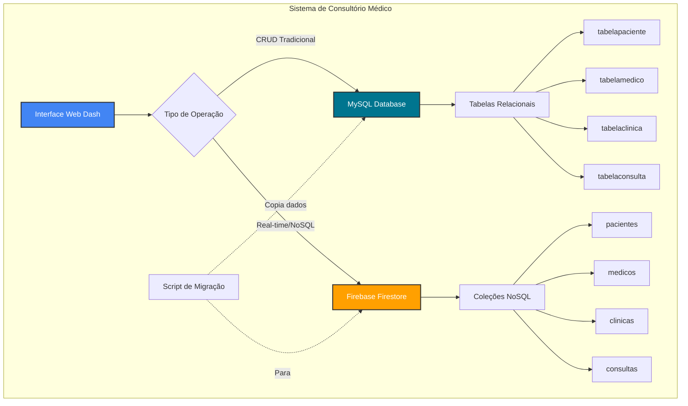
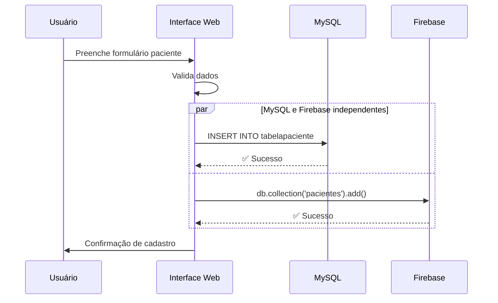
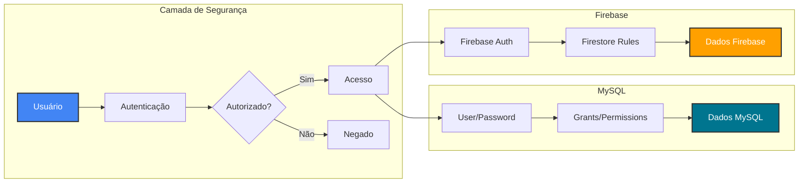

# 📊 Diagramas do Projeto NoSQL

Este arquivo contém diagramas em formato ASCII e Mermaid para visualização da arquitetura e comparação entre MySQL e Firebase.

---

## 🏗️ Arquitetura Geral do Sistema



---

## 📋 Estrutura de Dados: MySQL vs Firebase

### MySQL (Relacional - Normalizado)

```
┌─────────────────────────────────────────────────────────────────┐
│                        MYSQL DATABASE                            │
├─────────────────────────────────────────────────────────────────┤
│                                                                  │
│  ┌─────────────────┐                                            │
│  │ tabelapaciente  │                                            │
│  ├─────────────────┤                                            │
│  │ CpfPaciente PK  │◄────┐                                      │
│  │ NomePac         │     │                                      │
│  │ DataNasc        │     │                                      │
│  │ Genero          │     │                                      │
│  │ Telefone        │     │                                      │
│  │ Email           │     │                                      │
│  └─────────────────┘     │                                      │
│                           │                                      │
│  ┌─────────────────┐     │                                      │
│  │ tabelamedico    │     │                                      │
│  ├─────────────────┤     │                                      │
│  │ CodMed PK       │◄─┐  │                                      │
│  │ NomeMed         │  │  │                                      │
│  │ Especialidade   │  │  │                                      │
│  │ Telefone        │  │  │                                      │
│  │ Email           │  │  │                                      │
│  └─────────────────┘  │  │                                      │
│                        │  │                                      │
│  ┌─────────────────┐  │  │                                      │
│  │ tabelaclinica   │  │  │                                      │
│  ├─────────────────┤  │  │                                      │
│  │ CodCli PK       │◄┐│  │                                      │
│  │ NomeCli         │ ││  │                                      │
│  │ Endereco        │ ││  │                                      │
│  │ Telefone        │ ││  │                                      │
│  │ Email           │ ││  │                                      │
│  └─────────────────┘ ││  │                                      │
│                       ││  │                                      │
│  ┌─────────────────┐ ││  │                                      │
│  │ tabelaconsulta  │ ││  │                                      │
│  ├─────────────────┤ ││  │                                      │
│  │ CodCli FK       │─┘│  │                                      │
│  │ CodMed FK       │──┘  │                                      │
│  │ CpfPaciente FK  │─────┘                                      │
│  │ Data_Hora       │                                            │
│  └─────────────────┘                                            │
│                                                                  │
│  JOIN para consulta completa:                                   │
│  SELECT * FROM tabelaconsulta c                                 │
│    JOIN tabelapaciente p ON c.CpfPaciente = p.CpfPaciente      │
│    JOIN tabelamedico m ON c.CodMed = m.CodMed                  │
│    JOIN tabelaclinica cl ON c.CodCli = cl.CodCli;              │
│                                                                  │
└─────────────────────────────────────────────────────────────────┘
```

---

### Firebase (NoSQL - Embedded)

```
┌─────────────────────────────────────────────────────────────────┐
│                    FIREBASE FIRESTORE                            │
├─────────────────────────────────────────────────────────────────┤
│                                                                  │
│  Collection: consultas                                           │
│  ┌───────────────────────────────────────────────────────────┐ │
│  │ Document ID: auto-generated                                │ │
│  │ {                                                           │ │
│  │   "data_hora": "2024-12-02T14:30:00Z",                    │ │
│  │   "status": "realizada",                                   │ │
│  │                                                             │ │
│  │   "paciente": {                    ┌─ Dados embedded       │ │
│  │     "cpf": "12345678900",          │  (SEM JOIN!)         │ │
│  │     "nome": "João Silva",          │                       │ │
│  │     "data_nascimento": "1990-05",  │                       │ │
│  │     "genero": "M",                 │                       │ │
│  │     "telefone": "(11) 98765-4321", │                       │ │
│  │     "email": "joao@email.com"      │                       │ │
│  │   },                               └─ Tudo em 1 documento │ │
│  │                                                             │ │
│  │   "medico": {                                              │ │
│  │     "codigo": "MED123",                                    │ │
│  │     "nome": "Dra. Maria Santos",                          │ │
│  │     "especialidade": "Cardiologia",                       │ │
│  │     "telefone": "(11) 3456-7890",                         │ │
│  │     "email": "maria@clinica.com"                          │ │
│  │   },                                                        │ │
│  │                                                             │ │
│  │   "clinica": {                                             │ │
│  │     "codigo": "CLI456",                                    │ │
│  │     "nome": "Clínica MedCare",                            │ │
│  │     "endereco": "Rua das Flores, 123",                    │ │
│  │     "telefone": "(11) 3000-0000"                          │ │
│  │   },                                                        │ │
│  │                                                             │ │
│  │   "observacoes": "Consulta de rotina",                    │ │
│  │   "valor": 250.00                                          │ │
│  │ }                                                           │ │
│  └───────────────────────────────────────────────────────────┘ │
│                                                                  │
│  Query simples (1 operação):                                    │
│  db.collection('consultas')                                     │
│    .where('paciente.cpf', '==', '12345678900')                 │
│    .get()                                                       │
│                                                                  │
│  ✅ Todos os dados já estão no documento!                      │
│                                                                  │
└─────────────────────────────────────────────────────────────────┘
```

---

## 🔄 Fluxo de Operações CRUD

### CREATE (Criar Paciente)



---

### READ (Buscar Consultas de um Paciente)

#### MySQL (4 JOINs)
```
┌────────────────────────────────────────────────────────┐
│ Query MySQL                                             │
├────────────────────────────────────────────────────────┤
│                                                         │
│  SELECT c.*, p.*, m.*, cl.*                            │
│  FROM tabelaconsulta c                                 │
│    JOIN tabelapaciente p                               │
│      ON c.CpfPaciente = p.CpfPaciente                 │
│    JOIN tabelamedico m                                 │
│      ON c.CodMed = m.CodMed                           │
│    JOIN tabelaclinica cl                               │
│      ON c.CodCli = cl.CodCli                          │
│  WHERE p.CpfPaciente = '12345678900'                   │
│                                                         │
│  ┌───────────┐    ┌──────────┐                        │
│  │ Tabela 1  │───►│ Tabela 2 │                        │
│  └───────────┘    └──────────┘                        │
│       │                  │                              │
│       └──────┬───────────┘                              │
│              │                                          │
│         ┌────▼────┐    ┌──────────┐                   │
│         │ Tabela 3│───►│ Tabela 4 │                   │
│         └─────────┘    └──────────┘                   │
│                                                         │
│  ⏱️ Tempo: ~50-100ms                                   │
│  🔄 4 tabelas processadas                              │
│                                                         │
└────────────────────────────────────────────────────────┘
```

#### Firebase (1 query)
```
┌────────────────────────────────────────────────────────┐
│ Query Firebase                                          │
├────────────────────────────────────────────────────────┤
│                                                         │
│  db.collection('consultas')                            │
│    .where('paciente.cpf', '==', '12345678900')        │
│    .get()                                              │
│                                                         │
│  ┌─────────────────────────────────────┐              │
│  │   📄 Documento completo              │              │
│  │   ├── paciente (embedded)            │              │
│  │   ├── medico (embedded)              │              │
│  │   ├── clinica (embedded)             │              │
│  │   └── dados da consulta              │              │
│  └─────────────────────────────────────┘              │
│                                                         │
│  ⏱️ Tempo: ~20-40ms                                    │
│  🔄 1 coleção acessada                                 │
│  ✅ 2x mais rápido!                                    │
│                                                         │
└────────────────────────────────────────────────────────┘
```

---

## 📊 Comparação de Performance

```
┌─────────────────────────────────────────────────────────────┐
│           PERFORMANCE: MySQL vs Firebase                     │
├─────────────────────────────────────────────────────────────┤
│                                                              │
│  Operação: Buscar consultas de 1 paciente                   │
│                                                              │
│  MySQL (4 JOINs):                                           │
│  ████████████████████████████████████  ~80ms               │
│                                                              │
│  Firebase (Embedded):                                       │
│  ███████████████  ~30ms                                     │
│                                                              │
│  ┌────────────────────────────────────────────┐            │
│  │ Vencedor: Firebase (2.6x mais rápido)      │            │
│  └────────────────────────────────────────────┘            │
│                                                              │
├─────────────────────────────────────────────────────────────┤
│                                                              │
│  Operação: Agregação (Consultas por especialidade)         │
│                                                              │
│  MySQL (GROUP BY):                                          │
│  ████████  ~30ms                                            │
│                                                              │
│  Firebase (Processamento Client):                          │
│  ████████████████████████████████████████████  ~200ms      │
│                                                              │
│  ┌────────────────────────────────────────────┐            │
│  │ Vencedor: MySQL (6.6x mais rápido)         │            │
│  └────────────────────────────────────────────┘            │
│                                                              │
└─────────────────────────────────────────────────────────────┘
```

---

## 🔐 Arquitetura de Segurança



---

## 🌍 Escalabilidade

### MySQL - Escalabilidade Vertical

```
┌───────────────────────────────────────────────────────┐
│ MySQL: Escala Vertical (Hardware Melhor)              │
├───────────────────────────────────────────────────────┤
│                                                        │
│  Servidor Inicial:                                    │
│  ┌──────────────┐                                     │
│  │ 4 CPU        │  →  1.000 usuários                 │
│  │ 8GB RAM      │                                     │
│  │ 100GB SSD    │                                     │
│  └──────────────┘                                     │
│                                                        │
│  ↓ Upgrade necessário                                 │
│                                                        │
│  Servidor Médio:                                      │
│  ┌──────────────┐                                     │
│  │ 16 CPU       │  →  10.000 usuários                │
│  │ 64GB RAM     │      💰💰 Custo 4x maior            │
│  │ 1TB SSD      │                                     │
│  └──────────────┘                                     │
│                                                        │
│  ↓ Upgrade necessário                                 │
│                                                        │
│  Servidor Grande:                                     │
│  ┌──────────────┐                                     │
│  │ 64 CPU       │  →  50.000 usuários                │
│  │ 512GB RAM    │      💰💰💰💰💰 Custo 20x maior      │
│  │ 10TB SSD     │                                     │
│  └──────────────┘                                     │
│                                                        │
│  ⚠️ Limite: Hardware físico                           │
│                                                        │
└───────────────────────────────────────────────────────┘
```

### Firebase - Escalabilidade Horizontal

```
┌───────────────────────────────────────────────────────┐
│ Firebase: Escala Horizontal (Mais Servidores)         │
├───────────────────────────────────────────────────────┤
│                                                        │
│  1.000 usuários:                                      │
│  ┌────┐                                               │
│  │ S1 │  💰 Baixo custo                               │
│  └────┘                                               │
│                                                        │
│  ↓ Escala automática                                  │
│                                                        │
│  10.000 usuários:                                     │
│  ┌────┐ ┌────┐ ┌────┐                                │
│  │ S1 │ │ S2 │ │ S3 │  💰💰 Custo 3x                 │
│  └────┘ └────┘ └────┘                                │
│                                                        │
│  ↓ Escala automática                                  │
│                                                        │
│  100.000 usuários:                                    │
│  ┌────┐ ┌────┐ ┌────┐ ┌────┐ ┌────┐                 │
│  │ S1 │ │ S2 │ │ S3 │ │... │ │S10 │  💰💰💰 Custo 10x│
│  └────┘ └────┘ └────┘ └────┘ └────┘                 │
│                                                        │
│  ✅ Sem limite técnico                                │
│  ✅ Google gerencia tudo                              │
│  ✅ Custo cresce linearmente                          │
│                                                        │
└───────────────────────────────────────────────────────┘
```

---

## 🎯 Casos de Uso Recomendados

```
┌──────────────────────────────────────────────────────────────┐
│                    QUANDO USAR CADA UM                        │
├──────────────────────────────────────────────────────────────┤
│                                                               │
│  ✅ USE MYSQL PARA:                                          │
│  ┌─────────────────────────────────────────────────────┐    │
│  │ 📊 Relatórios complexos (GROUP BY, JOINs)          │    │
│  │ 💰 Transações financeiras (ACID completo)          │    │
│  │ 📋 Dados altamente estruturados e relacionados     │    │
│  │ 🔗 Integridade referencial crítica (FKs)           │    │
│  │ 📈 Análises estatísticas avançadas                 │    │
│  └─────────────────────────────────────────────────────┘    │
│                                                               │
│  Exemplo Consultório:                                        │
│    • Gestão principal de consultas                           │
│    • Relatórios financeiros                                  │
│    • Folha de pagamento                                      │
│    • Controle de estoque                                     │
│    • Histórico completo de pacientes                         │
│                                                               │
├──────────────────────────────────────────────────────────────┤
│                                                               │
│  ✅ USE FIREBASE PARA:                                       │
│  ┌─────────────────────────────────────────────────────┐    │
│  │ ⚡ Real-time (chat, notificações ao vivo)          │    │
│  │ 📱 Apps mobile (offline sync nativo)               │    │
│  │ 🚀 Protótipos e MVPs (dev rápido)                  │    │
│  │ 🌍 Escala global imprevisível                      │    │
│  │ 📄 Dados hierárquicos/aninhados                    │    │
│  └─────────────────────────────────────────────────────┘    │
│                                                               │
│  Exemplo Consultório:                                        │
│    • Agendamento online real-time                            │
│    • Chat médico-paciente                                    │
│    • Notificações push                                       │
│    • App mobile com offline                                  │
│    • Dashboard público (tempo de espera)                     │
│                                                               │
└──────────────────────────────────────────────────────────────┘
```

---

## 🏆 Arquitetura Híbrida Recomendada

```
┌─────────────────────────────────────────────────────────────────────┐
│              SISTEMA DE CONSULTÓRIO MÉDICO - HÍBRIDO                │
├─────────────────────────────────────────────────────────────────────┤
│                                                                      │
│                    ┌───────────────────────┐                        │
│                    │   Interface Web/App   │                        │
│                    └──────────┬────────────┘                        │
│                               │                                      │
│                ┌──────────────┴─────────────┐                       │
│                │                             │                       │
│      ┌─────────▼────────┐         ┌─────────▼────────┐            │
│      │   MySQL Database  │         │ Firebase Firestore│            │
│      │   (Principal)     │         │  (Complementar)   │            │
│      └─────────┬─────────┘         └──────────┬────────┘            │
│                │                                │                     │
│   ┌────────────┴────────────┐      ┌──────────┴───────────┐        │
│   │                          │      │                       │        │
│   │ • Gestão de consultas    │      │ • Agendamento online │        │
│   │ • Histórico completo     │      │ • Chat médico-pac.   │        │
│   │ • Relatórios financeiros │      │ • Notificações push  │        │
│   │ • Folha de pagamento     │      │ • App mobile         │        │
│   │ • Controle de estoque    │      │ • Dashboard público  │        │
│   │ • Integridade de dados   │      │ • Real-time updates  │        │
│   │                          │      │                       │        │
│   └──────────────────────────┘      └───────────────────────┘        │
│                                                                      │
│         🔄 Sincronização opcional entre os bancos                   │
│         (Script de migração disponível)                              │
│                                                                      │
└─────────────────────────────────────────────────────────────────────┘
```

---

## 📝 Como Visualizar os Diagramas

### Diagramas Mermaid

Os diagramas com sintaxe `mermaid` podem ser visualizados em:

1. **GitHub**: Renderiza automaticamente
2. **VS Code**: Extensão "Markdown Preview Mermaid Support"
3. **Online**: https://mermaid.live/

### Diagramas ASCII

Os diagramas ASCII são visualizados diretamente em qualquer editor de texto ou markdown viewer.

---

## 🎨 Exportar para Apresentação

Para usar esses diagramas em apresentações:

1. **Screenshot**: Capture os diagramas renderizados
2. **Mermaid PNG**: Use https://mermaid.live/ e exporte como PNG
3. **ASCII to Image**: Use https://asciiflow.com/ para editar e exportar
4. **PowerPoint/Google Slides**: Cole as imagens exportadas

---

**Última atualização**: Dezembro 2024  
**Projeto**: Integração NoSQL - Sistema de Consultório Médico
